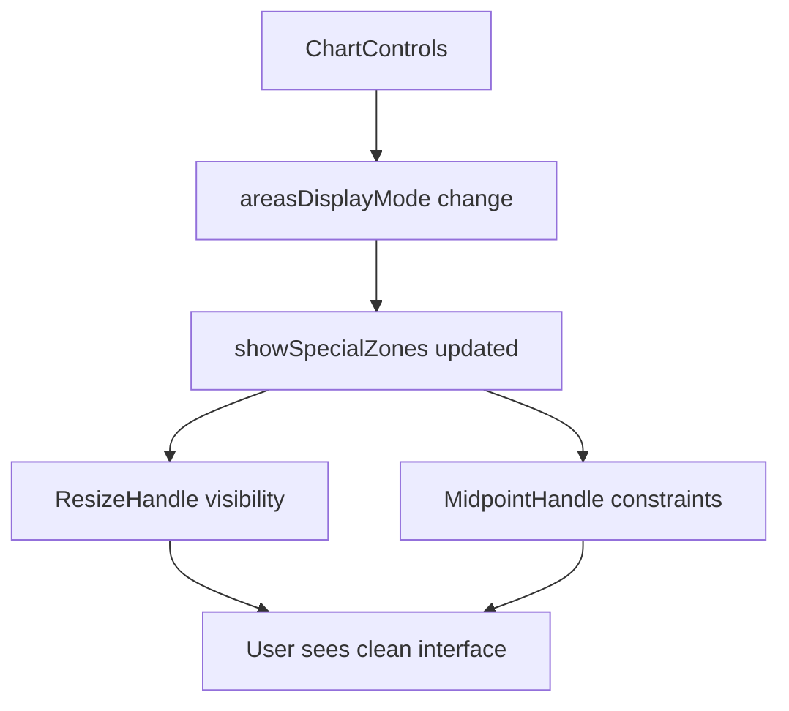

# ChartControls Component - Complete Documentation v3.0

## Overview
The ChartControls component provides a comprehensive interface for managing all visualization settings in the Apostles Model. It handles model terminology, detail levels, labeling, grid display, and data point frequency filtering through a collapsible panel interface, with enhanced areas display mode integration.

## Features
- Model terminology switching (Classic/Modern)
- Areas display mode (No Areas, Main Areas, All Areas)
- Label management system
- Grid display controls
- Midpoint adjustment controls
- Frequency filtering
- Scale number display
- Legend management
- Collapsible interface
- **NEW v3.0**: Enhanced areas mode with resizer integration
- **NEW v3.0**: Improved midpoint constraint coordination

## Component Structure

### Main Container
```tsx
<div className="chart-controls-wrapper">
  <Header/>
  <ControlGroups/>
</div>
```

### Control Groups
1. **Terminology Group**
   - Classic/Modern terminology switch
   - **Areas display mode toggle (No Areas/Main Areas/All Areas)** - Enhanced in v3.0

2. **Labels Group**
   - All labels
   - Quadrants only
   - Sub-sections (available when near-apostles is active)
   - No labels

3. **Display Group**
   - Grid toggle
   - Scale numbers toggle
   - Legends toggle
   - **Fixed/Adjustable mode switch** - Now coordinates with areas mode

4. **Frequency Group** (shown when overlapping points exist)
   - Frequency filter toggle
   - Threshold slider

## Interface

### Props
```typescript
interface ChartControlsProps {
  // Model controls
  isClassicModel: boolean;
  setIsClassicModel: (value: boolean) => void;
  
  // Areas display mode - Enhanced v3.0
  areasDisplayMode: 1 | 2 | 3; // 1=No Areas, 2=Main Areas, 3=All Areas
  setAreasDisplayMode: (mode: 1 | 2 | 3) => void;
  hasSpaceForNearApostles: boolean;

  // Label controls
  labelMode: 'all' | 'quadrants' | 'sub-sections' | 'none';
  setLabelMode: (mode: 'all' | 'quadrants' | 'sub-sections' | 'none') => void;
  showSpecialZoneLabels: boolean;
  setSpecialZoneLabels: (show: boolean) => void;
  
  // Grid controls
  showGrid: boolean;
  setShowGrid: (show: boolean) => void;
  
  // Center adjustment - Enhanced coordination v3.0
  isAdjustableMidpoint: boolean;
  setIsAdjustableMidpoint: (adjustable: boolean) => void;
  
  // Frequency filtering
  frequencyFilterEnabled: boolean;
  frequencyThreshold: number;
  setFrequencyFilterEnabled: (enabled: boolean) => void;
  setFrequencyThreshold: (threshold: number) => void;
  frequencyData: {
    maxFrequency: number;
    hasOverlaps: boolean;
  };
  
  // Scale and Legend controls
  showScaleNumbers: boolean;
  setShowScaleNumbers: (show: boolean) => void;
  showLegends: boolean;
  setShowLegends: (show: boolean) => void;
}
```

## Areas Display Mode System (Enhanced v3.0)

### Mode Configuration
```typescript
type AreasDisplayMode = 1 | 2 | 3;

// Mode 1: No Areas - only standard quadrants + HIDDEN resizers
// Mode 2: Main Areas - quadrants + apostles/terrorists zones + VISIBLE resizers  
// Mode 3: All Areas - everything including near-zones + VISIBLE resizers

const handleAreasDisplayModeChange = (position: AreasDisplayMode) => {
  setAreasDisplayMode(position);
  switch(position) {
    case 1: // No Areas
      setShowSpecialZones(false);
      setShowNearApostles(false);
      // NEW v3.0: Resizers automatically hidden via QuadrantChart logic
      break;
    case 2: // Main Areas
      setShowSpecialZones(true);
      setShowNearApostles(false);
      // NEW v3.0: Resizers visible if adjustable mode active
      break;
    case 3: // All Areas
      setShowSpecialZones(true);
      setShowNearApostles(true);
      // NEW v3.0: Resizers visible if adjustable mode active
      break;
  }
};
```

### Visualization Impact (v3.0)

#### Mode 1: "No Areas"
- **Visual**: Clean 4-quadrant display only
- **Resizers**: Hidden (even if adjustable mode active)
- **Midpoint**: Uses default constraints (1,1 zones)
- **Zone Sizes**: Preserved in memory
- **Labels**: Quadrant labels only

#### Mode 2: "Main Areas" 
- **Visual**: 4 quadrants + apostles/terrorists zones
- **Resizers**: Visible (if adjustable mode active)
- **Midpoint**: Uses actual zone sizes for constraints
- **Zone Sizes**: Active and interactive
- **Labels**: Quadrant + special zone labels

#### Mode 3: "All Areas"
- **Visual**: Everything including near-zones (L-shaped areas)
- **Resizers**: Visible (if adjustable mode active)
- **Midpoint**: Uses actual zone sizes + near-zone constraints
- **Zone Sizes**: Active and interactive
- **Labels**: All labels available

### Intelligent Disabling Logic (v3.0)

#### Areas Mode Control
```typescript
<ThreeStateToggle
  position={areasDisplayMode}
  onChange={handleAreasDisplayModeChange}
  labels={["No Areas", "Main Areas", "All Areas"]}
  disabled={false} // Always enabled - areas can work on any scale
  disabledPositions={!hasSpaceForNearApostles ? [3] : []}
  disabledPositionReason="No space available for near areas"
/>
```

#### Terminology Control Integration
```typescript
<TwoStateToggle
  leftLabel="Classic"
  rightLabel="Modern"
  value={isClassicModel ? 'left' : 'right'}
  onChange={(value: 'left' | 'right') => setIsClassicModel(value === 'left')}
  disabled={areasDisplayMode === 1} // Only disabled when no areas shown
  disabledReason={areasDisplayMode === 1 ? "Not applicable when areas are hidden" : undefined}
/>
```

## Component Coordination (v3.0)

### ResizeHandle Integration
The ChartControls coordinates with ResizeHandle visibility:

```typescript
// In QuadrantChart.tsx - coordinated by ChartControls state
const shouldShowResizers = isAdjustableMidpoint && showSpecialZones;

<ResizeHandle
  dimensions={dimensions}
  apostlesZoneSize={apostlesZoneSize}
  terroristsZoneSize={terroristsZoneSize}
  onZoneResize={handleZoneResize}
  isAdjustable={shouldShowResizers} // NEW v3.0: Combined condition
/>
```

### MidpointHandle Integration  
The ChartControls provides `showSpecialZones` state to MidpointHandle:

```typescript
// In QuadrantChart.tsx - state provided by ChartControls
<MidpointHandle
  // ... other props
  showSpecialZones={showSpecialZones} // NEW v3.0: From ChartControls
  apostlesZoneSize={apostlesZoneSize}
  terroristsZoneSize={terroristsZoneSize}
/>
```

## Auto-switching Behaviors

### Areas Display Mode
```typescript
// Auto-switch from "All Areas" to "Main Areas" when space runs out
useEffect(() => {
  if (areasDisplayMode === 3 && !hasSpaceForNearApostles) {
    console.log('🔄 Auto-switching from "All Areas" to "Main Areas" - no space available');
    setAreasDisplayMode(2);
    handleAreasDisplayModeChange(2);
  }
}, [hasSpaceForNearApostles, areasDisplayMode, handleAreasDisplayModeChange]);
```

### Label Mode
```typescript
// Auto-switch from sub-sections when near-apostles becomes unavailable
useEffect(() => {
  if (!showNearApostles && labelMode === 'sub-sections') {
    setLabelMode('all');
    setShowQuadrantLabels(true);
    setSpecialZoneLabels(true);
  }
}, [showNearApostles, labelMode]);
```

## User Experience Improvements (v3.0)

### Problem Solved
**Before v3.0**: Areas mode and interactive controls were disconnected:
- Resizers remained visible in "No Areas" mode
- Users could interact with invisible elements
- Midpoint movement was mysteriously constrained
- Inconsistent visual and interactive behavior

**After v3.0**: Seamless integration:
- Resizers intelligently hidden when not applicable
- Clean "No Areas" visualization without clutter
- Midpoint movement adapts to areas mode
- Consistent user experience across all modes

### State Management Flow (v3.0)


## Usage Examples

### Basic Usage
```tsx
function VisualizationContainer() {
  const [isClassicModel, setIsClassicModel] = useState(false);
  const [areasDisplayMode, setAreasDisplayMode] = useState<1 | 2 | 3>(2);
  const [labelMode, setLabelMode] = useState<'all' | 'quadrants' | 'sub-sections' | 'none'>('all');

  return (
    <ChartControls
      isClassicModel={isClassicModel}
      setIsClassicModel={setIsClassicModel}
      areasDisplayMode={areasDisplayMode}
      setAreasDisplayMode={setAreasDisplayMode}
      hasSpaceForNearApostles={true}
      labelMode={labelMode}
      setLabelMode={setLabelMode}
      // ... other props
    />
  );
}
```

### Advanced Configuration (v3.0)
```tsx
function AdvancedVisualization() {
  // State management
  const [controls, setControls] = useState({
    isClassicModel: false,
    areasDisplayMode: 2 as const,
    labelMode: 'all' as const,
    showGrid: true,
    isAdjustableMidpoint: false
  });

  // Frequency filtering
  const [frequencyFilter, setFrequencyFilter] = useState({
    enabled: false,
    threshold: 1
  });

  const frequencyData = useMemo(() => ({
    maxFrequency: Math.max(...data.map(d => d.frequency || 1)),
    hasOverlaps: data.some(d => (d.frequency || 1) > 1)
  }), [data]);

  return (
    <ChartControls
      isClassicModel={controls.isClassicModel}
      setIsClassicModel={(value) => setControls(prev => ({ ...prev, isClassicModel: value }))}
      areasDisplayMode={controls.areasDisplayMode}
      setAreasDisplayMode={(mode) => setControls(prev => ({ ...prev, areasDisplayMode: mode }))}
      hasSpaceForNearApostles={hasSpaceForNearApostles}
      labelMode={controls.labelMode}
      setLabelMode={(mode) => setControls(prev => ({ ...prev, labelMode: mode }))}
      showGrid={controls.showGrid}
      setShowGrid={(show) => setControls(prev => ({ ...prev, showGrid: show }))}
      isAdjustableMidpoint={controls.isAdjustableMidpoint}
      setIsAdjustableMidpoint={(adjustable) => setControls(prev => ({ ...prev, isAdjustableMidpoint: adjustable }))}
      frequencyFilterEnabled={frequencyFilter.enabled}
      frequencyThreshold={frequencyFilter.threshold}
      setFrequencyFilterEnabled={(enabled) => setFrequencyFilter(prev => ({ ...prev, enabled }))}
      setFrequencyThreshold={(threshold) => setFrequencyFilter(prev => ({ ...prev, threshold }))}
      frequencyData={frequencyData}
    />
  );
}
```

## Component State Management

### Control Groups Visibility
```typescript
const renderControlGroups = () => {
  return (
    <>
      {/* Display Group - Always visible */}
      <DisplayGroup />
      
      {/* Labels Group - Always visible */}
      <LabelsGroup />
      
      {/* Frequency Group - Only when overlaps exist */}
      {frequencyData.hasOverlaps && <FrequencyGroup />}
      
      {/* Terminology Group - Always visible */}
      <TerminologyGroup />
    </>
  );
};
```

### Collapsible Interface
```typescript
const [isCollapsed, setIsCollapsed] = useState(false);

const toggleCollapse = () => {
  setIsCollapsed(!isCollapsed);
};
```

## Styling System

### CSS Structure
```css
.chart-controls-wrapper {
  /* Main container */
  position: relative;
  background: white;
  border-radius: 8px;
  box-shadow: 0 2px 8px rgba(0,0,0,0.1);
}

.chart-controls-header {
  /* Collapsible header */
  padding: 12px 16px;
  border-bottom: 1px solid #e0e0e0;
  cursor: pointer;
}

.chart-controls {
  /* Controls container */
  padding: 16px;
  max-height: 500px;
  overflow-y: auto;
}

.control-group {
  /* Individual control sections */
  margin-bottom: 20px;
  &:last-child {
    margin-bottom: 0;
  }
}

.control-section-title {
  /* Group headers */
  display: flex;
  align-items: center;
  gap: 8px;
  margin-bottom: 12px;
  font-weight: 600;
  color: #333;
}

.control-group-content {
  /* Control content area */
  display: flex;
  flex-direction: column;
  gap: 12px;
}
```

### Responsive Design
```css
@media (max-width: 768px) {
  .chart-controls-wrapper {
    width: 100%;
    max-width: none;
  }
  
  .control-group-content {
    gap: 8px;
  }
  
  .labels-buttons {
    flex-wrap: wrap;
  }
}
```

## Testing Strategies (v3.0)

### Unit Tests
```typescript
describe('ChartControls v3.0', () => {
  test('areas display mode disabling works correctly', () => {
    const { getByTestId } = render(
      <ChartControls 
        hasSpaceForNearApostles={false}
        areasDisplayMode={2}
        // ... other props
      />
    );
    
    const allAreasButton = getByTestId('areas-toggle-3');
    expect(allAreasButton).toBeDisabled();
    
    const mainAreasButton = getByTestId('areas-toggle-2');
    expect(mainAreasButton).toBeEnabled();
  });
  
  test('terminology switch disabled when no areas shown', () => {
    const { getByTestId } = render(
      <ChartControls 
        areasDisplayMode={1}
        // ... other props
      />
    );
    
    const terminologyToggle = getByTestId('terminology-toggle');
    expect(terminologyToggle).toBeDisabled();
  });
  
  test('resizer coordination works correctly', () => {
    const { rerender } = render(
      <ChartControls 
        areasDisplayMode={2}
        isAdjustableMidpoint={true}
        // ... other props
      />
    );
    
    // Switch to "No Areas"
    rerender(
      <ChartControls 
        areasDisplayMode={1}
        isAdjustableMidpoint={true}
        // ... other props
      />
    );
    
    // Verify showSpecialZones becomes false
    expect(mockSetShowSpecialZones).toHaveBeenCalledWith(false);
  });
  
  test('auto-switching from all areas when space unavailable', () => {
    const mockSetAreasDisplayMode = jest.fn();
    
    const { rerender } = render(
      <ChartControls 
        hasSpaceForNearApostles={true}
        areasDisplayMode={3}
        setAreasDisplayMode={mockSetAreasDisplayMode}
        // ... other props
      />
    );
    
    // Simulate space becoming unavailable
    rerender(
      <ChartControls 
        hasSpaceForNearApostles={false}
        areasDisplayMode={3}
        setAreasDisplayMode={mockSetAreasDisplayMode}
        // ... other props
      />
    );
    
    expect(mockSetAreasDisplayMode).toHaveBeenCalledWith(2);
  });
});
```

### Integration Tests (v3.0)
```typescript
describe('ChartControls Integration v3.0', () => {
  test('areas mode changes update visualization correctly', () => {
    const { getByTestId } = render(<FullVisualization />);
    
    // Start with Main Areas
    expect(getByTestId('resizers')).toBeVisible();
    expect(getByTestId('special-zones')).toBeVisible();
    
    // Switch to No Areas
    fireEvent.click(getByTestId('areas-toggle-1'));
    
    expect(getByTestId('resizers')).not.toBeVisible();
    expect(getByTestId('special-zones')).not.toBeVisible();
    
    // Switch back to Main Areas
    fireEvent.click(getByTestId('areas-toggle-2'));
    
    expect(getByTestId('resizers')).toBeVisible();
    expect(getByTestId('special-zones')).toBeVisible();
  });
  
  test('midpoint constraint adaptation works', () => {
    const { getByTestId } = render(<FullVisualization />);
    
    // Move resizers to custom positions
    const apostlesResizer = getByTestId('apostles-resizer');
    fireEvent.mouseDown(apostlesResizer, { clientX: 100, clientY: 100 });
    fireEvent.mouseMove(document, { clientX: 50, clientY: 50 });
    fireEvent.mouseUp(document);
    
    // Switch to No Areas
    fireEvent.click(getByTestId('areas-toggle-1'));
    
    // Try to move midpoint to previously restricted position
    const midpoint = getByTestId('midpoint-handle');
    fireEvent.mouseDown(midpoint, { clientX: 200, clientY: 200 });
    fireEvent.mouseMove(document, { clientX: 250, clientY: 200 });
    fireEvent.mouseUp(document);
    
    // Verify movement was allowed
    expect(getMidpointPosition()).toEqual({ sat: 4, loy: 5.5 });
  });
});
```

## Error Handling

### Validation
```typescript
const validateAreasDisplayMode = (mode: number): mode is AreasDisplayMode => {
  return [1, 2, 3].includes(mode);
};

const safeSetAreasDisplayMode = (mode: number) => {
  if (validateAreasDisplayMode(mode)) {
    setAreasDisplayMode(mode);
  } else {
    console.warn(`Invalid areas display mode: ${mode}`);
    setAreasDisplayMode(2); // Fallback to Main Areas
  }
};
```

### Edge Case Handling
```typescript
// Handle case where hasSpaceForNearApostles changes unexpectedly
useEffect(() => {
  if (areasDisplayMode === 3 && !hasSpaceForNearApostles) {
    console.log('🔄 Auto-switching from "All Areas" to "Main Areas" - no space available');
    setAreasDisplayMode(2);
  }
}, [hasSpaceForNearApostles, areasDisplayMode]);
```

## Dependencies
- React
- lucide-react (for icons)
- Switch component
- TwoStateToggle component  
- ThreeStateToggle component
- FrequencySlider component

## Related Components
- [ResizeHandles](./ResizeHandles.md) - Coordinated visibility control
- [MidpointHandle](./MidpointHandle.md) - Receives areas state for constraints
- [SpecialZoneRenderer](./SpecialZones.md) - Visual zone rendering
- [QuadrantChart](./QuadrantChart.md) - Main coordination component

## Changelog

### Version 3.0 (Current)
- **ENHANCED**: Areas display mode now coordinates with ResizeHandle visibility
- **NEW**: MidpointHandle integration for adaptive constraints
- **IMPROVED**: Seamless user experience across mode changes
- **ADDED**: Comprehensive integration testing
- **FIXED**: Eliminated inconsistent behavior between modes

### Version 2.0
- **FIXED**: Scale restriction logic - removed incorrect 1-3 scale disabling
- **IMPROVED**: Areas display mode intelligently disables only unavailable options
- **ENHANCED**: Auto-switching prevents invalid states

### Version 1.0
- Initial implementation
- Basic control functionality

## Migration Guide

### Updating from v2.0 to v3.0

#### No Breaking Changes
v3.0 is fully backward compatible. The enhanced coordination happens automatically through existing state management.

#### Enhanced Behavior
```typescript
// v2.0 behavior:
// - Areas mode only affected visual zones
// - Resizers always shown when adjustable
// - Midpoint constraints never adapted

// v3.0 behavior:
// - Areas mode coordinates all interactive elements
// - Resizers intelligently hidden when appropriate
// - Midpoint constraints adapt to areas visibility
```

#### Testing Updates
Update your tests to verify the new coordinated behavior:
```typescript
// NEW: Test resizer visibility coordination
test('resizers hidden in no areas mode', () => {
  // ... test implementation
});

// NEW: Test midpoint constraint adaptation  
test('midpoint constraints adapt to areas mode', () => {
  // ... test implementation
});
```

## Performance Considerations

### Render Optimization
```typescript
// Memoization for expensive calculations
const handleAreasDisplayModeChange = useCallback((mode: AreasDisplayMode) => {
  setAreasDisplayMode(mode);
  // State updates are automatically batched
}, [setAreasDisplayMode]);
```

### State Updates
- Batched state updates for mode changes
- Memoized callbacks prevent unnecessary re-renders
- Efficient coordination without performance impact

## Accessibility Features

### Keyboard Navigation
- Tab order follows visual layout
- Keyboard shortcuts for common actions
- Focus management during mode transitions

### ARIA Support
```typescript
<div 
  role="region"
  aria-label="Chart controls"
  aria-expanded={!isCollapsed}
>
  <ThreeStateToggle
    aria-label="Areas display mode"
    aria-describedby="areas-mode-description"
  />
</div>
```

### Screen Reader Support
- Meaningful labels and descriptions
- State change announcements
- Clear hierarchy and relationships

## Notes
- **v3.0**: Controls now coordinate all visualization elements seamlessly
- Areas display mode is the central control for special zone features
- Auto-switching prevents invalid states across all components
- Terminology controls work correctly regardless of satisfaction scale range
- Consider mobile-first approach for responsive design
- Document control interdependencies for future maintenance

---

*Document Version: 3.0*  
*Last Updated: January 2025*  
*Status: Production Ready ✅*  
*Major Update: Comprehensive areas mode coordination ✅*