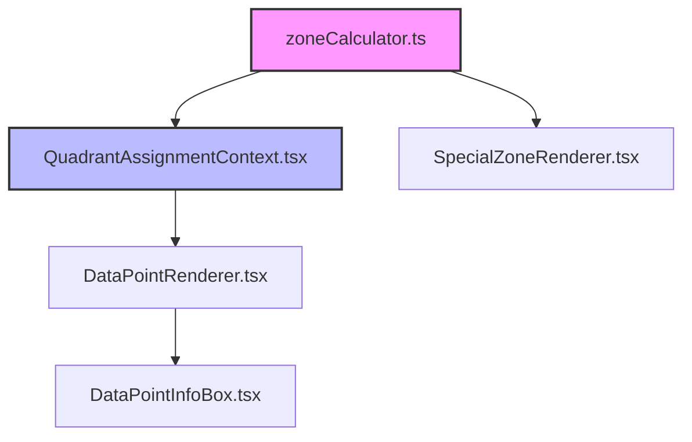

# Apostles Model Classification System - Complete Documentation

## Table of Contents
1. [Overview](#overview)
2. [The Problem We Solved](#the-problem-we-solved)
3. [Architecture & Dependencies](#architecture--dependencies)
4. [Core Mathematics](#core-mathematics)
5. [Data Flow](#data-flow)
6. [Classification Logic](#classification-logic)
7. [Visual vs Classification Alignment](#visual-vs-classification-alignment)
8. [Testing & Validation](#testing--validation)
9. [Maintenance Guidelines](#maintenance-guidelines)
10. [Troubleshooting](#troubleshooting)

---

## Overview

The Apostles Model Classification System determines which quadrant/zone each data point belongs to in a satisfaction vs loyalty visualization. It supports:

- **4 Standard Quadrants**: Loyalists, Mercenaries, Hostages, Defectors
- **2 Special Zones**: Apostles/Advocates (top-right) and Terrorists/Trolls (bottom-left)
- **2 Near Zones**: Near-Apostles and Near-Terrorists (L-shaped areas around special zones)
- **Dynamic Sizing**: Zones can be resized from 1x1 to larger squares
- **Scale Independence**: Works with any satisfaction/loyalty scale (1-5, 1-7, 1-10, etc.)

---

## The Problem We Solved

### The Issue
For months, there was a critical mismatch:
- **Visual zones** (colored areas) rendered correctly
- **InfoBox classifications** showed wrong results
- Points that appeared in green "Apostles" zones were classified as "Loyalists"

### Root Cause
The visual rendering and classification logic used **completely different calculation methods**:
- **Visual zones**: Used simple percentage-based positioning from corners
- **Classification**: Used complex grid calculations that didn't align

### The Solution
**Single Source of Truth**: Both visual and classification now use the same boundary calculation function (`calculateSpecialZoneBoundaries`) with coordinate-based logic.

---

## Architecture & Dependencies

### Core Files

```
src/components/visualization/
├── context/
│   └── QuadrantAssignmentContext.tsx    # 🎯 MAIN CLASSIFICATION LOGIC
├── utils/
│   └── zoneCalculator.ts                # 🔧 BOUNDARY CALCULATIONS
├── components/
│   └── Zones/
│       └── SpecialZoneRenderer.tsx      # 🎨 VISUAL ZONE RENDERING
└── components/
    └── DataPoints/
        ├── DataPointRenderer.tsx        # 📍 POINT POSITIONING
        └── DataPointInfoBox.tsx         # 💬 INFOBOX DISPLAY
```

### Dependency Chain



**Key Point**: `zoneCalculator.ts` is the **Single Source of Truth** for boundary calculations.

---

## Core Mathematics

### Zone Size Logic

The **fundamental insight** is that `apostlesZoneSize=1` creates a **2x2 area**, not a 1x1 point:

```typescript
// apostlesZoneSize=1 means: count 1 position down and 1 left from top-right corner
// This creates a 2x2 square area

// For 7x10 scale:
apostlesZoneSize=1 → (6,9), (6,10), (7,9), (7,10)  // 2x2 area
apostlesZoneSize=2 → (5,8), (5,9), (5,10), (6,8), (6,9), (6,10), (7,8), (7,9), (7,10)  // 3x3 area
```

### Boundary Calculation Formula

Located in `src/components/visualization/utils/zoneCalculator.ts`:

```typescript
export function calculateSpecialZoneBoundaries(
  apostlesZoneSize: number,
  terroristsZoneSize: number,
  maxSat: number,
  maxLoy: number
): SpecialZoneBoundaries {
  
  // APOSTLES ZONE (Top-Right Corner)
  // Start from (maxSat, maxLoy) and count inward by zoneSize
  const apostlesEdgeVertixSat = maxSat - apostlesZoneSize;
  const apostlesEdgeVertixLoy = maxLoy - apostlesZoneSize;
  
  // TERRORISTS ZONE (Bottom-Left Corner)  
  // Start from (1, 1) and count outward by zoneSize
  const terroristsEdgeVertixSat = 1 + terroristsZoneSize;
  const terroristsEdgeVertixLoy = 1 + terroristsZoneSize;
  
  return {
    apostles: { edgeVertixSat: apostlesEdgeVertixSat, edgeVertixLoy: apostlesEdgeVertixLoy },
    terrorists: { edgeVertixSat: terroristsEdgeVertixSat, edgeVertixLoy: terroristsEdgeVertixLoy }
  };
}
```

### Scale-Independent Design

The formula works for **any scale** because it uses **relative positioning**:

| Scale | apostlesZoneSize=1 | apostlesZoneSize=2 | 
|-------|-------------------|-------------------|
| 5x5   | (4,4), (4,5), (5,4), (5,5) | (3,3), (3,4), (3,5), (4,3), (4,4), (4,5), (5,3), (5,4), (5,5) |
| 7x10  | (6,9), (6,10), (7,9), (7,10) | (5,8) through (7,10) |
| 3x7   | (2,6), (2,7), (3,6), (3,7) | Only if midpoint allows |

---

## Data Flow

### 1. Initialization
```typescript
// In App.tsx
<QuadrantAssignmentProvider
  data={data}
  satisfactionScale="1-7"
  loyaltyScale="1-10"
  apostlesZoneSize={2}
  terroristsZoneSize={1}
  showNearApostles={true}
>
```

### 2. Context Setup
```typescript
// In QuadrantAssignmentContext.tsx
const boundaries = calculateSpecialZoneBoundaries(
  apostlesZoneSize,
  terroristsZoneSize,
  maxSat,
  maxLoy
);
```

### 3. Point Classification
```typescript
// For each data point, determine its quadrant
const quadrant = getQuadrantForPoint(point);
```

### 4. Visual Rendering
```typescript
// DataPointRenderer.tsx gets the classification
const quadrantInfo = getQuadrantInfo(point);
// InfoBox displays the result
<InfoBox quadrantInfo={quadrantInfo} />
```

---

## Classification Logic

Located in `src/components/visualization/context/QuadrantAssignmentContext.tsx`:

### Priority Order (Critical!)

The classification checks happen in **strict order**:

1. **Manual Assignments** (user overrides)
2. **Apostles Zone** (highest priority special zone)
3. **Terrorists Zone** 
4. **Near-Apostles Zone** (if enabled)
5. **Near-Terrorists Zone** (if enabled)
6. **Standard Quadrants** (fallback)

### Classification Rules

```typescript
const getQuadrantForPoint = (point: DataPoint): QuadrantType => {
  // 1. Manual assignments first
  if (manualAssignments.has(point.id)) {
    return manualAssignments.get(point.id)!;
  }
  
  // 2. Calculate boundaries
  const boundaries = calculateSpecialZoneBoundaries(/*...*/);
  
  // 3. APOSTLES CHECK (Square area from top-right)
  if (point.satisfaction >= boundaries.apostles.edgeVertixSat && 
      point.loyalty >= boundaries.apostles.edgeVertixLoy) {
    return 'apostles';
  }
  
  // 4. TERRORISTS CHECK (Square area from bottom-left)
  if (point.satisfaction <= boundaries.terrorists.edgeVertixSat && 
      point.loyalty <= boundaries.terrorists.edgeVertixLoy) {
    return 'terrorists';
  }
  
  // 5. NEAR-ZONES CHECK (L-shaped areas)
  if (showNearApostles && hasSpaceForNearApostles) {
    // Near-apostles L-shape around apostles zone
    const nearApostlesMinSat = boundaries.apostles.edgeVertixSat - 1;
    const nearApostlesMinLoy = boundaries.apostles.edgeVertixLoy - 1;
    
    // Left edge: sat = nearSat, loy >= apostlesLoy
    if (point.satisfaction === nearApostlesMinSat && 
        point.loyalty >= boundaries.apostles.edgeVertixLoy) {
      return 'near_apostles';
    }
    
    // Bottom edge: sat >= apostlesSat, loy = nearLoy  
    if (point.satisfaction >= boundaries.apostles.edgeVertixSat && 
        point.loyalty === nearApostlesMinLoy) {
      return 'near_apostles';
    }
    
    // Corner: sat = nearSat, loy = nearLoy
    if (point.satisfaction === nearApostlesMinSat && 
        point.loyalty === nearApostlesMinLoy) {
      return 'near_apostles';
    }
    
    // Similar logic for near-terrorists...
  }
  
  // 6. STANDARD QUADRANTS (based on midpoint)
  if (point.satisfaction >= midpoint.sat && point.loyalty >= midpoint.loy) {
    return 'loyalists';
  }
  // ... other standard quadrants
};
```

### Near-Zones L-Shape Logic

Near-zones form an **L-shaped border** around their main zones:

```
For apostlesZoneSize=2 on 7x10 scale:

   1 2 3 4 5 6 7 ← satisfaction
10 . . . N A A A ← loyalty
 9 . . . N A A A
 8 . . . N A A A  
 7 . . . N N N N  ← near-apostles bottom edge
 6 . . . . . . .
 5 . . . . . . .
 
N = Near-apostles
A = Apostles
```

The L-shape consists of:
- **Left edge**: One column to the left of apostles zone
- **Bottom edge**: One row below apostles zone  
- **Corner**: The intersection point

---

## Visual vs Classification Alignment

### Before (Broken)
```typescript
// Visual zones (SpecialZoneRenderer.tsx)
width: `${apostlesZoneSize * cellWidth}%`    // ✅ Correct

// Classification (QuadrantAssignmentContext.tsx)  
complexPercentageCalculation()               // ❌ Different method
```

### After (Fixed)
```typescript
// Visual zones (SpecialZoneRenderer.tsx)
width: `${apostlesZoneSize * cellWidth}%`    // ✅ Correct

// Classification (QuadrantAssignmentContext.tsx)
calculateSpecialZoneBoundaries()             // ✅ Same source of truth
```

### Validation
Both systems now produce identical results:
- Point (6,10) → Visual: Green apostles zone → InfoBox: "Apostles" ✅
- Point (4,7) → Visual: Light green near-apostles → InfoBox: "Near-Apostles" ✅

---

## Testing & Validation

### Automated Testing
Create test cases in `src/components/visualization/utils/__tests__/`:

```typescript
describe('Classification System', () => {
  test('apostlesZoneSize=1 creates 2x2 area', () => {
    const boundaries = calculateSpecialZoneBoundaries(1, 1, 7, 10);
    expect(boundaries.apostles.edgeVertixSat).toBe(6);
    expect(boundaries.apostles.edgeVertixLoy).toBe(9);
  });
  
  test('near-apostles L-shape formation', () => {
    // Test all L-shape positions
  });
});
```

### Manual Testing Checklist

For each scale combination:

1. **Apostles Zone**:
   - [ ] All points in visual green zone classify as "Apostles"
   - [ ] No points outside visual zone classify as "Apostles"

2. **Near-Apostles** (when enabled):
   - [ ] L-shaped border around apostles correctly classified
   - [ ] Left edge points: `(apostlesMin-1, apostlesLoy+)`
   - [ ] Bottom edge points: `(apostlesMin+, apostlesLoy-1)`
   - [ ] Corner point: `(apostlesMin-1, apostlesLoy-1)`

3. **Terrorists Zone**:
   - [ ] Bottom-left square area correctly classified
   
4. **Standard Quadrants**:
   - [ ] Remaining points classify based on midpoint correctly

### Debug Console Logs

The system includes comprehensive logging:

```typescript
🔧 calculateSpecialZoneBoundaries: apostlesZoneSize=2, maxSat=7, maxLoy=10
🔧 Apostles zone: satisfaction >= 5, loyalty >= 8
🎯 Point (6,4) -> NEAR-APOSTLES (bottom edge): sat>=5, loy=4
```

Use these logs to trace classification decisions.

---

## Maintenance Guidelines

### When Adding New Features

1. **Always Update Both Systems**: If you change zone logic, update both:
   - `zoneCalculator.ts` (boundaries)
   - `SpecialZoneRenderer.tsx` (visual positioning)

2. **Maintain Priority Order**: Special zones must be checked before standard quadrants

3. **Preserve Scale Independence**: New logic should work for any scale

### Common Pitfalls to Avoid

1. **❌ Don't use percentage calculations for classification**
   ```typescript
   // Wrong
   const pointSatPercent = ((point.satisfaction - 1) / (maxSat - 1)) * 100;
   ```

2. **❌ Don't duplicate boundary logic**
   ```typescript
   // Wrong - creates inconsistency  
   const customApostlesBoundary = maxSat - apostlesZoneSize + 1;
   ```

3. **✅ Always use the shared boundary function**
   ```typescript
   // Correct
   const boundaries = calculateSpecialZoneBoundaries(/*...*/);
   ```

### Performance Considerations

- `calculateSpecialZoneBoundaries` is lightweight (simple arithmetic)
- Classification runs for each point on every render
- Consider memoization for large datasets

### Code Review Checklist

When reviewing classification changes:
- [ ] Uses `calculateSpecialZoneBoundaries` as single source of truth
- [ ] Maintains correct priority order
- [ ] Includes appropriate debug logging
- [ ] Works for multiple scales
- [ ] Updates both visual and classification systems

---

## Troubleshooting

### Problem: InfoBox shows wrong classification

**Diagnosis Steps:**
1. Check console logs for classification decisions
2. Verify `calculateSpecialZoneBoundaries` output
3. Confirm priority order is maintained
4. Test with different zone sizes

**Common Causes:**
- Custom boundary calculations instead of shared function
- Wrong priority order (standard quadrants checked first)
- Percentage vs coordinate calculation mismatch

### Problem: Visual zones don't match classifications

**Root Cause:** Different calculation methods

**Fix:** Ensure both use `calculateSpecialZoneBoundaries`

### Problem: Near-zones not working

**Diagnosis:**
1. Check `showNearApostles` flag
2. Verify space availability calculation
3. Confirm L-shape coordinate logic

### Problem: Classifications change unexpectedly

**Common Causes:**
- Zone size changes affecting boundaries
- Midpoint position affecting space calculations
- Scale changes affecting coordinate ranges

### Debug Commands

```typescript
// Add to QuadrantAssignmentContext for debugging
console.log('Boundaries:', calculateSpecialZoneBoundaries(apostlesZoneSize, terroristsZoneSize, maxSat, maxLoy));
console.log('Point classification:', getQuadrantForPoint(point));
console.log('Zone sizes:', { apostlesZoneSize, terroristsZoneSize });
```

---

## Summary

The classification system works because it follows **three core principles**:

1. **Single Source of Truth**: `calculateSpecialZoneBoundaries` used everywhere
2. **Scale Independence**: Relative positioning from corners works for any scale  
3. **Coordinate-Based Logic**: Simple `>=` and `<=` comparisons instead of complex percentages

This design ensures that **visual zones and InfoBox classifications always match**, regardless of scale, zone size, or near-zones settings.

The system is now **maintenance-friendly** because any boundary changes only need to be made in one place (`zoneCalculator.ts`), and the mathematical approach is simple enough to understand and extend.

---

*Documentation Version: 1.0*  
*Last Updated: January 2025*  
*Status: Production Ready ✅*