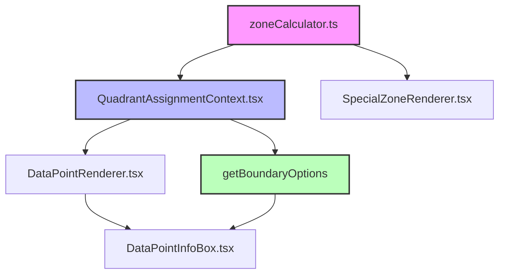

# Apostles Model Classification System v2.0 - Complete Documentation

## Table of Contents
1. [Overview](#overview)
2. [The Problem We Solved](#the-problem-we-solved)
3. [Architecture & Dependencies](#architecture--dependencies)
4. [Core Mathematics](#core-mathematics)
5. [Classification Logic](#classification-logic)
6. [Boundary Detection System](#boundary-detection-system)
7. [Data Flow](#data-flow)
8. [Visual vs Classification Alignment](#visual-vs-classification-alignment)
9. [Testing & Validation](#testing--validation)
10. [Maintenance Guidelines](#maintenance-guidelines)
11. [Troubleshooting](#troubleshooting)

---

## Overview

The Apostles Model Classification System determines which quadrant/zone each data point belongs to in a satisfaction vs loyalty visualization. It supports:

- **4 Standard Quadrants**: Loyalists, Mercenaries, Hostages, Defectors
- **2 Special Zones**: Apostles/Advocates (top-right) and Terrorists/Trolls (bottom-left)
- **2 Near Zones**: Near-Apostles and Near-Terrorists (L-shaped areas around special zones)
- **Dynamic Sizing**: Zones can be resized from 0.5x0.5 to larger squares (including half-grid positions)
- **Scale Independence**: Works with any satisfaction/loyalty scale (1-5, 1-7, 1-10, etc.)
- **Flexible Midpoints**: Supports midpoints on grid points (3, 6) or between grid points (3, 5.5)

---

## The Problem We Solved

### The Issue
For months, there was a critical mismatch:
- **Visual zones** (colored areas) rendered correctly
- **InfoBox classifications** showed wrong results
- **Boundary detection** offered incorrect reassignment options
- Points that appeared in green "Apostles" zones were classified as "Loyalists"
- Near-apostles points showed 3 options instead of 2

### Root Cause
The visual rendering, classification logic, and boundary detection used **completely different calculation methods**:
- **Visual zones**: Used simple percentage-based positioning from corners
- **Classification**: Used complex grid calculations that didn't align
- **Boundary detection**: Grid edge logic interfered with special zone boundaries

### The Solution
1. **Single Source of Truth**: Both visual and classification now use the same boundary calculation function (`calculateSpecialZoneBoundaries`)
2. **Early Return for Special Zones**: Boundary detection uses early return to prevent interference
3. **Coordinate-Based Logic**: Simple `>=` and `<=` comparisons instead of complex percentages

---

## Architecture & Dependencies

### Core Files

```
src/components/visualization/
├── context/
│   └── QuadrantAssignmentContext.tsx    # 🎯 MAIN CLASSIFICATION & BOUNDARY LOGIC
├── utils/
│   └── zoneCalculator.ts                # 🔧 BOUNDARY CALCULATIONS (SINGLE SOURCE OF TRUTH)
├── components/
│   └── Zones/
│       └── SpecialZoneRenderer.tsx      # 🎨 VISUAL ZONE RENDERING
└── components/
    └── DataPoints/
        ├── DataPointRenderer.tsx        # 📍 POINT POSITIONING & INFOBOX TRIGGER
        └── DataPointInfoBox.tsx         # 💬 INFOBOX DISPLAY & REASSIGNMENT OPTIONS
```

### Dependency Chain



**Key Points**: 
- `zoneCalculator.ts` is the **Single Source of Truth** for boundary calculations
- `getBoundaryOptions()` provides reassignment options with early return for special zones
- All systems use the same mathematical foundation

---

## Core Mathematics

### Zone Size Logic

The **fundamental insight** is that `apostlesZoneSize=1` creates a **2x2 area**, not a 1x1 point:

```typescript
// apostlesZoneSize=1 means: count 1 position down and 1 left from top-right corner
// This creates a 2x2 square area

// For 7x10 scale:
apostlesZoneSize=1 → (6,9), (6,10), (7,9), (7,10)  // 2x2 area
apostlesZoneSize=2 → (5,8) through (7,10)          // 3x3 area
apostlesZoneSize=0.5 → (7,10) only                 // 1x1 area (half-grid)
```

### Boundary Calculation Formula

Located in `src/components/visualization/utils/zoneCalculator.ts`:

```typescript
export function calculateSpecialZoneBoundaries(
  apostlesZoneSize: number,
  terroristsZoneSize: number,
  maxSat: number,
  maxLoy: number
): SpecialZoneBoundaries {
  
  // APOSTLES ZONE (Top-Right Corner)
  // Start from (maxSat, maxLoy) and count inward by zoneSize
  const apostlesEdgeVertixSat = maxSat - apostlesZoneSize;
  const apostlesEdgeVertixLoy = maxLoy - apostlesZoneSize;
  
  // TERRORISTS ZONE (Bottom-Left Corner)  
  // Start from (1, 1) and count outward by zoneSize
  const terroristsEdgeVertixSat = 1 + terroristsZoneSize;
  const terroristsEdgeVertixLoy = 1 + terroristsZoneSize;
  
  return {
    apostles: { edgeVertixSat: apostlesEdgeVertixSat, edgeVertixLoy: apostlesEdgeVertixLoy },
    terrorists: { edgeVertixSat: terroristsEdgeVertixSat, edgeVertixLoy: terroristsEdgeVertixLoy }
  };
}
```

### Scale-Independent Design

The formula works for **any scale** because it uses **relative positioning**:

| Scale | apostlesZoneSize=1 | apostlesZoneSize=2 | apostlesZoneSize=0.5 |
|-------|-------------------|-------------------|----------------------|
| 5x5   | (4,4), (4,5), (5,4), (5,5) | (3,3) through (5,5) | (5,5) only |
| 7x10  | (6,9), (6,10), (7,9), (7,10) | (5,8) through (7,10) | (7,10) only |
| 3x7   | (2,6), (2,7), (3,6), (3,7) | Only if midpoint allows | (3,7) only |

### Midpoint Flexibility

The system handles midpoints both **on grid points** and **between grid points**:

#### **On Grid Points**
```
Midpoint at (3, 6):
   1 2 3 4 5 ← satisfaction  
10 H H | L L ← loyalty
 9 H H | L L
 8 H H | L L
 7 H H | L L
 6 H H | L L ← Exact grid point
 5 M M | M M
```

#### **Between Grid Points**  
```
Midpoint at (3, 5.5):
   1 2 3 4 5 ← satisfaction  
10 H H | L L ← loyalty
 9 H H | L L
5.5 ---- ---- ← Between grid points
 5 M M | M M
```

**Classification Logic**:
- On grid: `point.loyalty === midpoint.loy` → boundary point
- Between grid: `point.loyalty < midpoint.loy` vs `point.loyalty >= midpoint.loy` → clean classification

---

## Classification Logic

Located in `src/components/visualization/context/QuadrantAssignmentContext.tsx`:

### Priority Order (Critical!)

The classification checks happen in **strict order**:

1. **Manual Assignments** (user overrides)
2. **Special Zones** (if enabled):
   - **Apostles Zone** (highest priority special zone)
   - **Terrorists Zone**
3. **Near Zones** (if enabled and space available):
   - **Near-Apostles Zone** 
   - **Near-Terrorists Zone**
4. **Standard Quadrants** (fallback)

### Core Classification Function

```typescript
const getQuadrantForPoint = (point: DataPoint): QuadrantType => {
  // 1. Manual assignments first
  if (manualAssignments.has(point.id)) {
    return manualAssignments.get(point.id)!;
  }
  
  // 2. Calculate boundaries (SINGLE SOURCE OF TRUTH)
  const boundaries = calculateSpecialZoneBoundaries(
    apostlesZoneSize, terroristsZoneSize, maxSat, maxLoy
  );
  
  // 3. SPECIAL ZONES CHECK (if enabled)
  if (showSpecialZones) {
    // APOSTLES CHECK (Square area from top-right)
    if (point.satisfaction >= boundaries.apostles.edgeVertixSat && 
        point.loyalty >= boundaries.apostles.edgeVertixLoy) {
      return 'apostles';
    }
    
    // TERRORISTS CHECK (Square area from bottom-left)
    if (point.satisfaction <= boundaries.terrorists.edgeVertixSat && 
        point.loyalty <= boundaries.terrorists.edgeVertixLoy) {
      return 'terrorists';
    }
  }
  
  // 4. NEAR-ZONES CHECK (if enabled and space available)
  if (showNearApostles && hasSpaceForNearApostles) {
    const nearApostlesMinSat = boundaries.apostles.edgeVertixSat - 1;
    const nearApostlesMinLoy = boundaries.apostles.edgeVertixLoy - 1;
    
    // Near-apostles L-shape:
    // Left edge: sat = nearSat, loy >= apostlesLoy
    if (point.satisfaction === nearApostlesMinSat && 
        point.loyalty >= boundaries.apostles.edgeVertixLoy) {
      return 'near_apostles';
    }
    
    // Bottom edge: sat >= apostlesSat, loy = nearLoy  
    if (point.satisfaction >= boundaries.apostles.edgeVertixSat && 
        point.loyalty === nearApostlesMinLoy) {
      return 'near_apostles';
    }
    
    // Corner: sat = nearSat, loy = nearLoy
    if (point.satisfaction === nearApostlesMinSat && 
        point.loyalty === nearApostlesMinLoy) {
      return 'near_apostles';
    }
    
    // Similar logic for near-terrorists...
  }
  
  // 5. STANDARD QUADRANTS (based on midpoint)
  if (point.satisfaction >= midpoint.sat && point.loyalty >= midpoint.loy) {
    return 'loyalists';
  }
  if (point.satisfaction >= midpoint.sat && point.loyalty < midpoint.loy) {
    return 'mercenaries';
  }
  if (point.satisfaction < midpoint.sat && point.loyalty >= midpoint.loy) {
    return 'hostages';
  }
  return 'defectors';
};
```

### Near-Zones L-Shape Logic

Near-zones form an **L-shaped border** around their main zones:

```
For apostlesZoneSize=1 on 5x10 scale:

   1 2 3 4 5 ← satisfaction
10 . . N A A ← loyalty
 9 . . N A A
 8 . . N N N ← L-shape bottom edge
 7 . . . . .
 6 . . . . .

N = Near-apostles
A = Apostles
```

The L-shape consists of:
- **Left edge**: One column to the left of apostles zone (`sat = apostlesMinSat - 1, loy >= apostlesMinLoy`)
- **Bottom edge**: One row below apostles zone (`sat >= apostlesMinSat, loy = apostlesMinLoy - 1`)
- **Corner**: The intersection point (`sat = apostlesMinSat - 1, loy = apostlesMinLoy - 1`)

---

## Boundary Detection System

The boundary detection system provides InfoBox reassignment options. **This was the most complex part to fix.**

### The Critical Fix: Early Return + Midpoint Priority

**Problem**: Grid edge detection was interfering with special zone boundaries, and midpoint intersections weren't getting proper priority.

**Solution**: 
1. **Midpoint intersection priority**: Handle points exactly on midpoint intersection first
2. **Early return for special zones**: Prevent standard boundary logic from executing

```typescript
const getBoundaryOptions = (point: DataPoint): QuadrantOption[] => {
  // PRIORITY 1: Midpoint intersection (highest priority)
  if (point.satisfaction === midpoint.sat && point.loyalty === midpoint.loy) {
    console.log(`🎯 Point is exactly on midpoint intersection - showing all 4 quadrants`);
    return ['loyalists', 'mercenaries', 'hostages', 'defectors'].map(quadrant => ({
      group: getDisplayName(quadrant),
      color: getColor(quadrant)
    }));
  }

  // PRIORITY 2: Special zone boundaries with early return
  if (currentQuadrant === 'near_apostles' || currentQuadrant === 'near_terrorists') {
    // ... complex near-zone boundary detection ...
    
    // 🎯 CRITICAL FIX: Early return prevents standard logic interference
    return Array.from(neighbors).map(quadrant => ({
      quadrant,
      color: getColorForQuadrant(quadrant)
    }));
  }
  
  // PRIORITY 3: Standard boundary logic only runs for non-special zones
  // ...
};
```

### Boundary Types

1. **Midpoint Intersection Boundaries**: Highest priority - all four standard quadrants
2. **Near-Zone Inner Boundaries**: Near-apostles ↔ Apostles
3. **Near-Zone Outer Boundaries**: Near-apostles ↔ Standard quadrants (Hostages, Loyalists)
4. **Standard Midpoint Boundaries**: Hostages ↔ Loyalists, etc.
5. **Grid Edge Boundaries**: Only for standard quadrant points at visualization edges

### Expected Results

| Point Location | Zone | Expected Reassignment Options |
|---------------|------|------------------------------|
| (2, 6) | Midpoint Intersection | All four standard quadrants |
| (3, 5.5) | Midpoint Intersection | All four standard quadrants |
| (3, 9) | Near-Apostles | Near-Apostles, Hostages |
| (4, 9) | Apostles | Apostles, Near-Apostles |
| (3, 7) | Hostages | Hostages, Loyalists |
| (1, 7) | Hostages (grid edge) | Hostages, potentially Loyalists |

---

## Data Flow

### 1. Initialization
```typescript
// In App.tsx or similar
<QuadrantAssignmentProvider
  data={data}
  satisfactionScale="1-7"
  loyaltyScale="1-10"
  apostlesZoneSize={2}