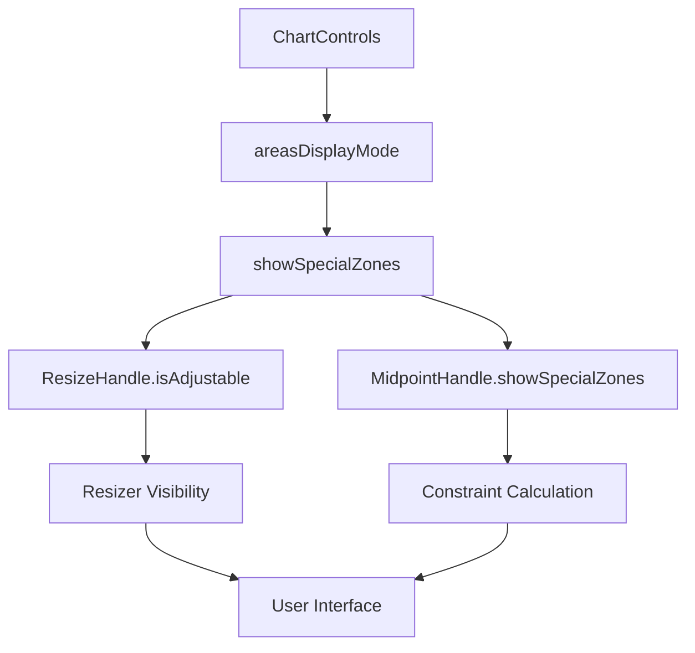

# Resizer and Midpoint Interaction System - Complete Guide v1.0

## Overview

This document describes the comprehensive interaction system between ResizeHandles and MidpointHandle components in the Apostles Model visualization, including the intelligent visibility control and constraint coordination implemented in v3.0.

## Table of Contents
1. [System Architecture](#system-architecture)
2. [The Problem We Solved](#the-problem-we-solved)
3. [Component Interaction](#component-interaction)
4. [Constraint System](#constraint-system)
5. [Areas Mode Integration](#areas-mode-integration)
6. [User Experience Flows](#user-experience-flows)
7. [Edge Cases & Testing](#edge-cases--testing)
8. [Implementation Details](#implementation-details)

---

## System Architecture

### Core Components
```
ChartControls (State Manager)
    ↓ coordinates
QuadrantChart (Orchestrator)
    ↓ manages
ResizeHandle ←→ MidpointHandle
    ↓ influences     ↓ constrains
SpecialZones    Standard Quadrants
```

### State Flow


---

## The Problem We Solved

### The Issue (Pre-v3.0)
Users experienced confusing and inconsistent behavior when switching between areas display modes:

1. **Invisible Interference**: Resizers remained visible in "No Areas" mode
2. **Mysterious Constraints**: Midpoint movement was blocked by invisible zone sizes
3. **Inconsistent UX**: Visual state didn't match interactive capabilities
4. **User Confusion**: No clear indication why midpoint couldn't move to certain positions

### Real-World Example
```typescript
// User Scenario (5-10 scale):
// 1. Move apostles resizer to create apostlesZoneSize=2
// 2. Switch to "No Areas" mode
// 3. Try to move midpoint from (3, 5.5) to (4, 5.5)
// RESULT: Movement blocked at satisfaction=3 (invisible wall)

// Root Cause:
// - Visual: No zones visible
// - Logic: maxSat = 5 - 2 = 3 (still using apostlesZoneSize=2)
// - User: "Why can't I move the midpoint?"
```

### The Solution (v3.0)
Implemented intelligent coordination between all interactive elements:

1. **Unified Visibility**: Resizers hidden when areas not applicable
2. **Adaptive Constraints**: Midpoint uses context-appropriate zone sizes
3. **Consistent UX**: Visual state always matches interactive capabilities
4. **Clear Behavior**: Predictable and logical user experience

---

## Component Interaction

### ResizeHandle ↔ Areas Mode
```typescript
// In QuadrantChart.tsx
const shouldShowResizers = isAdjustableMidpoint && showSpecialZones;

<ResizeHandle
  dimensions={dimensions}
  apostlesZoneSize={apostlesZoneSize}
  terroristsZoneSize={terroristsZoneSize}
  onZoneResize={handleZoneResize}
  isAdjustable={shouldShowResizers} // Combined condition
/>
```

**Behavior:**
- **Mode 1 (No Areas)**: `showSpecialZones = false` → Resizers hidden
- **Mode 2 (Main Areas)**: `showSpecialZones = true` → Resizers visible (if adjustable)
- **Mode 3 (All Areas)**: `showSpecialZones = true` → Resizers visible (if adjustable)

### MidpointHandle ↔ Areas Mode
```typescript
// In QuadrantChart.tsx
<MidpointHandle
  // ... other props
  showSpecialZones={showSpecialZones}
  apostlesZoneSize={apostlesZoneSize}
  terroristsZoneSize={terroristsZoneSize}
/>

// In MidpointHandle.tsx
const effectiveApostlesSize = showSpecialZones ? apostlesZoneSize : 1;
const effectiveTerroristsSize = showSpecialZones ? terroristsZoneSize : 1;

const minSat = effectiveTerroristsSize + 1;
let maxSat = dimensions.totalCols - effectiveApostlesSize;
```

**Behavior:**
- **Areas Visible**: Uses actual resizer positions for constraints
- **Areas Hidden**: Uses default (1,1) sizes for constraints

---

## Constraint System

### Constraint Calculation Logic

#### Standard Constraint Formula
```typescript
// Basic constraint ensuring 4-quadrant integrity
const minSat = effectiveTerroristsSize + 1;
const maxSat = dimensions.totalCols - effectiveApostlesSize;
const minLoy = effectiveTerroristsSize + 1;  
const maxLoy = dimensions.totalRows - effectiveApostlesSize;
```

#### Effective Zone Size Logic
```typescript
// Context-aware zone sizes
const effectiveApostlesSize = showSpecialZones ? apostlesZoneSize : 1;
const effectiveTerroristsSize = showSpecialZones ? terroristsZoneSize : 1;
```

### Constraint Examples

#### 5x10 Scale Example
```typescript
// Scenario: apostlesZoneSize=2, terroristsZoneSize=1

// WITH AREAS VISIBLE (showSpecialZones = true):
effectiveApostlesSize = 2, effectiveTerroristsSize = 1
minSat = 1 + 1 = 2
maxSat = 5 - 2 = 3  
minLoy = 1 + 1 = 2
maxLoy = 10 - 2 = 8
// Result: Midpoint constrained to (2-3, 2-8)

// WITH AREAS HIDDEN (showSpecialZones = false):
effectiveApostlesSize = 1, effectiveTerroristsSize = 1
minSat = 1 + 1 = 2
maxSat = 5 - 1 = 4
minLoy = 1 + 1 = 2  
maxLoy = 10 - 1 = 9
// Result: Midpoint constrained to (2-4, 2-9) - More freedom!
```

#### 3x5 Scale Example (Small Grid)
```typescript
// WITH ANY ZONE SIZES:
minSat = 2, maxSat = 2 (only valid position)
minLoy = 2, maxLoy = 4
// Result: Midpoint constrained to (2, 2-4)
// Maintains 4 quadrants even in small grid
```

### Quadrant Integrity Rules
The system **ALWAYS** ensures all 4 quadrants have minimum 1x1 size:

1. **Defectors** (bottom-left): `sat < midpoint.sat AND loy < midpoint.loy`
2. **Hostages** (top-left): `sat < midpoint.sat AND loy ≥ midpoint.loy`  
3. **Mercenaries** (bottom-right): `sat ≥ midpoint.sat AND loy < midpoint.loy`
4. **Loyalists** (top-right): `sat ≥ midpoint.sat AND loy ≥ midpoint.loy`

---

## Areas Mode Integration

### Mode Behaviors

#### Mode 1: "No Areas"
```typescript
// State Changes:
showSpecialZones = false
showNearApostles = false

// Visual Impact:
- Only 4 standard quadrants visible
- Clean, uncluttered interface
- No special zone colors or labels

// Interactive Impact:
- Resizers hidden (even if adjustable mode active)
- Midpoint uses default constraints (more freedom)
- Zone sizes preserved in memory for restoration
```

#### Mode 2: "Main Areas"  
```typescript
// State Changes:
showSpecialZones = true
showNearApostles = false

// Visual Impact:
- 4 quadrants + apostles/terrorists zones
- Special zone colors and labels visible
- Standard visualization mode

// Interactive Impact:
- Resizers visible (if adjustable mode active)
- Midpoint uses actual zone constraints
- Full resizer functionality available
```

#### Mode 3: "All Areas"
```typescript
// State Changes:
showSpecialZones = true
showNearApostles = true

// Visual Impact:
- Everything including near-zones (L-shaped areas)
- All labels and colors visible
- Most comprehensive view

// Interactive Impact:
- Resizers visible (if adjustable mode active)
- Midpoint uses actual zones + near-zone constraints
- Additional near-apostles management logic
```

### State Transition Flows

#### Switching TO "No Areas"
```mermaid
graph TD
    A[User clicks 'No Areas'] --> B[setAreasDisplayMode(1)]
    B --> C[showSpecialZones = false]
    C --> D[Resizers disappear]
    C --> E[Midpoint constraints switch to default]
    D --> F[Clean interface]
    E --> F
```

#### Switching FROM "No Areas"
```mermaid
graph TD
    A[User clicks 'Main/All Areas'] --> B[setAreasDisplayMode(2/3)]
    B --> C[showSpecialZones = true]
    C --> D[Resizers reappear at saved positions]
    C --> E[Midpoint constraints restore to actual sizes]
    D --> F[Full functionality restored]
    E --> F
```

---

## User Experience Flows

### Typical User Journey

#### Initial Setup
1. User loads 5-10 scale data
2. Chart displays in "Main Areas" mode by default
3. Midpoint at (3, 5.5), resizers at default positions

#### Customization Phase
1. User enables "Adjustable" mode
2. User moves apostles resizer from (4,9) to (3,8)
3. `apostlesZoneSize` changes from 1 to 2
4. Midpoint movement now constrained by new zone size

#### Clean View Phase  
1. User switches to "No Areas" for clean 4-quadrant view
2. Resizers disappear automatically
3. Midpoint gains movement freedom (can now reach (4, 5.5))
4. Visual interface is uncluttered

#### Restoration Phase
1. User switches back to "Main Areas"  
2. Resizers reappear at (3,8) position
3. Zone constraints restore
4. Full functionality available again

### Edge Case Handling

#### Small Grid Scenarios
```typescript
// 3x5 Scale: Very limited space
// Resizers may be functionally useless but still shown when appropriate
// Midpoint movement severely constrained but 4-quadrant integrity maintained

// System Response:
// - Resizers visible when areas shown (may have minimal effect)
// - "No Areas" mode provides only slight additional freedom
// - Clear constraint feedback to user
```

#### Rapid Mode Switching
```typescript
// User rapidly switches: No Areas → Main Areas → No Areas
// System Response:
// - Smooth transitions without flicker
// - State consistency maintained
// - No position jumping or jarring changes
// - Zone sizes correctly preserved and restored
```

---

## Edge Cases & Testing

### Critical Test Scenarios

#### Constraint Adaptation Test
```typescript
test('midpoint constraints adapt to areas mode', () => {
  // Setup: Move resizers to custom positions
  setApostlesZoneSize(2);
  setTerroristsZoneSize(1);
  
  // Test: Areas visible - should use actual sizes
  setShowSpecialZones(true);
  const constraintsWithAreas = calculateConstraints();
  expect(constraintsWithAreas).toEqual({
    minSat: 2, maxSat: 3, minLoy: 2, maxLoy: 8
  });
  
  // Test: Areas hidden - should use default sizes
  setShowSpecialZones(false);
  const constraintsWithoutAreas = calculateConstraints();
  expect(constraintsWithoutAreas).toEqual({
    minSat: 2, maxSat: 4, minLoy: 2, maxLoy: 9
  });
});
```

#### Resizer Visibility Test
```typescript
test('resizers hidden in no areas mode', () => {
  // Setup: Adjustable mode active
  setIsAdjustableMidpoint(true);
  
  // Test: Main Areas - resizers visible
  setShowSpecialZones(true);
  expect(screen.getByTestId('resize-handles')).toBeVisible();
  
  // Test: No Areas - resizers hidden
  setShowSpecialZones(false);
  expect(screen.queryByTestId('resize-handles')).not.toBeInTheDocument();
});
```

#### State Preservation Test
```typescript
test('zone sizes preserved during mode switches', () => {
  // Setup: Custom zone sizes
  setApostlesZoneSize(3);
  setTerroristsZoneSize(2);
  
  // Test: Switch to No Areas
  setAreasDisplayMode(1);
  expect(getApostlesZoneSize()).toBe(3); // Preserved in memory
  
  // Test: Switch back to Main Areas
  setAreasDisplayMode(2);
  expect(getApostlesZoneSize()).toBe(3); // Restored correctly
});
```

#### Small Grid Edge Case Test
```typescript
test('maintains quadrant integrity on small grids', () => {
  // Setup: 3x5 scale
  const dimensions = { totalCols: 3, totalRows: 5 };
  
  // Test: Any midpoint position should maintain 4 quadrants
  const testPositions = [
    { sat: 2, loy: 2 },
    { sat: 2, loy: 3 },
    { sat: 2, loy: 4 }
  ];
  
  testPositions.forEach(position => {
    const quadrants = calculateQuadrantSizes(position, dimensions);
    expect(quadrants.every(size => size >= 1)).toBe(true);
  });
});
```

### Performance Testing
```typescript
test('mode switches are performant', () => {
  const startTime = performance.now();
  
  // Perform rapid mode switches
  for (let i = 0; i < 100; i++) {
    setAreasDisplayMode(i % 3 + 1);
  }
  
  const endTime = performance.now();
  expect(endTime - startTime).toBeLessThan(100); // 100ms threshold
});
```

---

## Implementation Details

### Key Files and Changes

#### QuadrantChart.tsx
```typescript
// CHANGED: ResizeHandle visibility condition
<ResizeHandle
  isAdjustable={isAdjustableMidpoint && showSpecialZones} // Combined condition
/>

// ADDED: showSpecialZones prop to MidpointHandle
<MidpointHandle
  showSpecialZones={showSpecialZones} // New prop
  // ... other props
/>
```

#### MidpointHandle.tsx
```typescript
// ADDED: showSpecialZones prop to interface
interface MidpointHandleProps {
  // ... existing props
  showSpecialZones: boolean; // New required prop
}

// CHANGED: Constraint calculation logic
const effectiveApostlesSize = showSpecialZones ? apostlesZoneSize : 1;
const effectiveTerroristsSize = showSpecialZones ? terroristsZoneSize : 1;

const minSat = effectiveTerroristsSize + 1;
let maxSat = dimensions.totalCols - effectiveApostlesSize;
```

#### ResizeHandle.tsx
```typescript
// NO CHANGES to component logic
// Visibility controlled externally via isAdjustable prop
// Maintains existing size calculation and interaction logic
```

### State Management Pattern
```typescript
// Centralized state in QuadrantChart
const showSpecialZones = areasDisplayMode !== 1; // No Areas = mode 1

// Coordinated distribution to child components
const resizeHandleProps = {
  isAdjustable: isAdjustableMidpoint && showSpecialZones
};

const midpointHandleProps = {
  showSpecialZones: showSpecialZones
};
```

### Error Handling
```typescript
// Graceful degradation for missing props
const showSpecialZones = props.showSpecialZones ?? true; // Default to true

// Validation of constraint calculations
const validateConstraints = (constraints: Constraints) => {
  const { minSat, maxSat, minLoy, maxLoy } = constraints;
  
  // Ensure valid ranges
  if (minSat >= maxSat || minLoy >= maxLoy) {
    console.warn('Invalid constraint ranges detected, using fallback');
    return {
      minSat: 2,
      maxSat: dimensions.totalCols - 1,
      minLoy: 2, 
      maxLoy: dimensions.totalRows - 1
    };
  }
  
  return constraints;
};

// Boundary validation
const ensureQuadrantIntegrity = (midpoint: Midpoint, dimensions: GridDimensions) => {
  const quadrantSizes = {
    defectors: { width: midpoint.sat - 1, height: midpoint.loy - 1 },
    hostages: { width: midpoint.sat - 1, height: dimensions.totalRows - midpoint.loy },
    mercenaries: { width: dimensions.totalCols - midpoint.sat, height: midpoint.loy - 1 },
    loyalists: { width: dimensions.totalCols - midpoint.sat, height: dimensions.totalRows - midpoint.loy }
  };
  
  // Verify all quadrants have minimum size
  const allValid = Object.values(quadrantSizes).every(size => 
    size.width >= 1 && size.height >= 1
  );
  
  if (!allValid) {
    console.error('Quadrant integrity violation detected', { midpoint, quadrantSizes });
  }
  
  return allValid;
};
```

## Debugging and Troubleshooting

### Common Issues and Solutions

#### Issue: Resizers Still Visible in "No Areas" Mode
```typescript
// Diagnosis:
console.log('showSpecialZones:', showSpecialZones);
console.log('isAdjustableMidpoint:', isAdjustableMidpoint);
console.log('Combined condition:', isAdjustableMidpoint && showSpecialZones);

// Solution: Verify prop passing
// Check QuadrantChart.tsx ResizeHandle instantiation
<ResizeHandle isAdjustable={isAdjustableMidpoint && showSpecialZones} />
```

#### Issue: Midpoint Movement Still Constrained When Areas Hidden
```typescript
// Diagnosis:
console.log('showSpecialZones prop received:', showSpecialZones);
console.log('effectiveApostlesSize:', effectiveApostlesSize);
console.log('effectiveTerroristsSize:', effectiveTerroristsSize);
console.log('Calculated constraints:', { minSat, maxSat, minLoy, maxLoy });

// Solution: Verify MidpointHandle receives showSpecialZones prop
// Check QuadrantChart.tsx MidpointHandle instantiation
<MidpointHandle showSpecialZones={showSpecialZones} />
```

#### Issue: State Not Preserved During Mode Switches
```typescript
// Diagnosis:
console.log('Zone sizes before switch:', { apostlesZoneSize, terroristsZoneSize });
// ... perform switch ...
console.log('Zone sizes after switch:', { apostlesZoneSize, terroristsZoneSize });

// Solution: Verify state management in QuadrantAssignmentContext
// Zone sizes should persist in memory when areas are hidden
```

### Debug Logging Pattern
```typescript
// Add to components for debugging
const debugMode = process.env.NODE_ENV === 'development';

if (debugMode) {
  console.log('🔧 ResizeHandle Debug:', {
    isAdjustable,
    showSpecialZones,
    apostlesZoneSize,
    terroristsZoneSize,
    visibility: isAdjustable ? 'visible' : 'hidden'
  });
  
  console.log('🎯 MidpointHandle Debug:', {
    showSpecialZones,
    effectiveApostlesSize,
    effectiveTerroristsSize,
    constraints: { minSat, maxSat, minLoy, maxLoy }
  });
}
```

## Best Practices

### State Management
1. **Single Source of Truth**: Areas mode state controlled by ChartControls
2. **Prop Drilling**: Clear prop passing from parent to children
3. **State Preservation**: Zone sizes maintained in memory during mode switches
4. **Validation**: Constraint calculations always validated for integrity

### User Experience
1. **Predictable Behavior**: Visual state always matches interactive capabilities
2. **Smooth Transitions**: No jarring position changes during mode switches
3. **Clear Feedback**: User understands what they can and cannot do
4. **Performance**: Mode switches are instantaneous

### Development
1. **Comprehensive Testing**: Cover all mode combinations and edge cases
2. **Debug Logging**: Extensive logging for troubleshooting
3. **Error Handling**: Graceful degradation for edge cases
4. **Documentation**: Clear documentation of all interactions

## Future Enhancements

### Potential Improvements
1. **Animation**: Smooth fade transitions for resizer show/hide
2. **User Feedback**: Tooltip explanations for disabled states
3. **Keyboard Support**: Keyboard shortcuts for mode switching
4. **Accessibility**: Enhanced ARIA labels for mode changes

### Extensibility
1. **Additional Zones**: Framework supports new special zone types
2. **Custom Constraints**: Configurable constraint calculation rules
3. **Mode Presets**: Save/restore custom mode configurations
4. **Advanced Interactions**: Multi-touch support for mobile

## Related Documentation

- [ResizeHandles Component - Complete Documentation v3.0](./ResizeHandles.md)
- [MidpointHandle Component - Complete Documentation v3.0](./MidpointHandle.md)  
- [ChartControls Component - Complete Documentation v3.0](./ChartControls.md)
- [Apostles Model Classification System - Complete Documentation](./Classification-System.md)

## Conclusion

The Resizer and Midpoint Interaction System v1.0 provides a seamless, intuitive user experience for the Apostles Model visualization. By intelligently coordinating visibility and constraints across all interactive elements, users can focus on their data analysis without fighting the interface.

The system maintains mathematical integrity (4-quadrant rule) while providing maximum flexibility and freedom appropriate to each visualization mode. Comprehensive testing and debugging capabilities ensure reliable operation across all scenarios.

---

*Document Version: 1.0*  
*Created: January 2025*  
*Status: Production Ready ✅*  
*System Integration: Complete ✅*
  